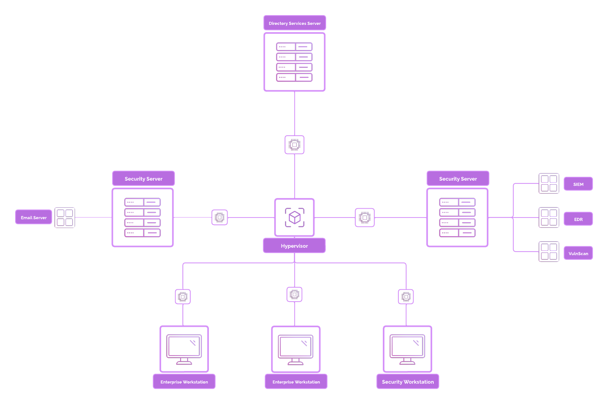

# Cybersecurity Homelab (ProjectSecurity E101)

This repository documents my implementation of the [ProjectSecurity E101 Homelab](https://docs.projectsecurity.io/e101/overview) by Grant Collins.  

The lab simulates a small enterprise environment to practice core defensive and offensive security skills.  
Although I followed the guide closely, I used the build process to troubleshoot, explore configurations, and develop my own study notes, which are included here.  

---

## 🖥️ Lab Overview

The environment replicates an enterprise network with Active Directory, workstations, servers, and both defensive and offensive security tooling.  

**Core components:**  
- **Domain Controller** (Windows Server 2025 – AD, DNS, DHCP, SSO)  
- **Corporate Server** (Ubuntu Server – email & applications) Used a Docker container to run Mialhog as our SMTP server.
- **Windows & Linux Clients** (employee workstations)  
- **Security Servers** (Security Onion, Ubuntu Desktop for monitoring)  
- **Attacker Machine** (Kali Linux – adversary simulation)  

📊 **Lab Topology**  
  

---

## 🔧 Tools & Technologies

**Enterprise & Defense:**  
- Microsoft Active Directory  
- Wazuh (SIEM)  
- Security Onion (IDS/Monitoring)  
- MailHog (Email testing)  

**Offense / Red Teaming:**  
- Evil-WinRM  
- Hydra  
- SecLists  
- NetExec  
- XFreeRDP  

---

## 🎯 Skills Practiced

- Built and configured a Windows domain environment with multiple hosts  
- Set up centralized logging and monitoring (Wazuh, Security Onion)  
- Practiced log analysis, detection engineering, and SIEM queries  
- Simulated phishing and reverse shell attacks in a controlled lab  
- Troubleshot common networking and configuration issues  

---

## 📚 Learning Notes

I created my own study notes to reinforce understanding:  
- [Active Directory Setup & Concepts](notes/active-directory.md)  
- [SIEM & Log Analysis with Wazuh](notes/siem-wazuh.md)  
- [Detection Engineering with Sigma](notes/detection-engineering.md)  
- [Troubleshooting & Fixes](notes/troubleshooting.md)  

---

## ⚡ Challenges & Troubleshooting

Some examples of where I had to troubleshoot during the lab:  
- **Networking issues** – fixed NAT and DHCP scope conflicts  
- **Logs not ingesting** – corrected Sysmon config for Splunk/Wazuh pipelines  
- **IDS performance drops** – tuned Security Onion and filtered noisy alerts  
- **Domain join errors** – resolved via DNS/AD configuration changes  

---

## 📖 References

- [ProjectSecurity E101 Guide by Grant Collins](https://docs.projectsecurity.io/e101/overview)  
- [E101 GitHub Resources](https://github.com/collinsmc23/projectsecurity-e101)  
- Microsoft Documentation (AD, Sysmon)  
- Wazuh & Security Onion Docs  

---

✍️ **Note:** This repository is primarily for documentation and learning. The original E101 lab is the work of Grant Collins, and all credit goes to him for creating such a structured learning program.
